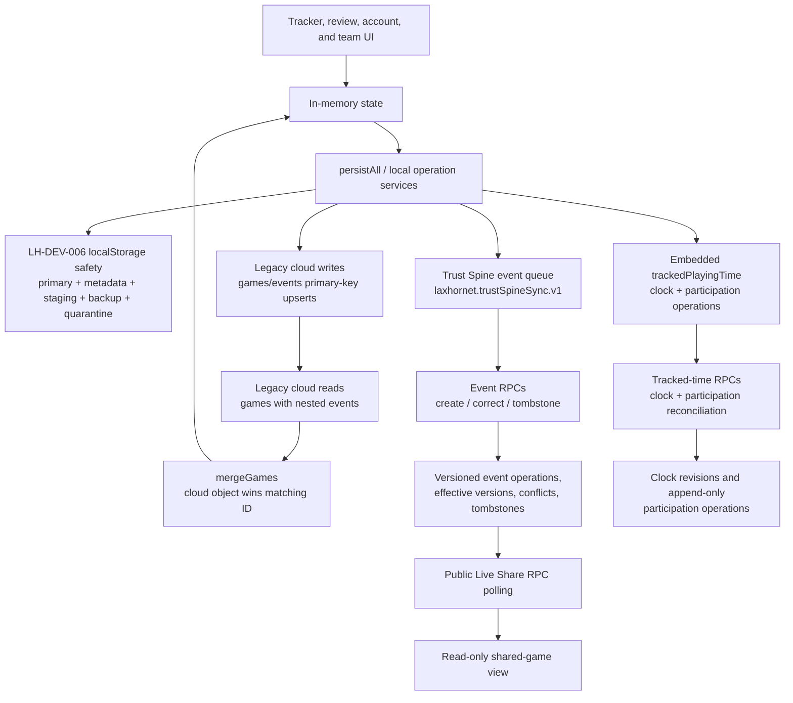

# R2 Current Local/Cloud Sync Inventory

Status: `R2-01 DISCOVERY COMPLETE — REVIEW REQUIRED`

Risk level: `LEVEL 3 — CRITICAL DISCOVERY`

Baseline: `origin/main` at `fff8c3fe4f9cf285c3c092a713bef3d3f24c03e1`

Investigation date: 2026-07-30

This document inventories current behavior. It does not define or implement the
desired R2 synchronization model. Recommendations and proposed tickets are
deliberately separated from the current-state sections.

## 1. Executive summary

LaxHornet is locally immediate but not uniformly conflict-safe.
`createLocalStorageSafety`, `persistAll`, and the event/tracked-time service
boundaries synchronously preserve game-day changes before cloud work begins.
The LH-DEV-006 sidecars add per-domain validation, staging, one backup,
quarantine, and future-schema write blocking. The current baseline also contains
Lean Development Workflow v2, corrected Docker CI, and the reconciled rollout
checklist.

The cloud side contains three different synchronization models:

1. Legacy `games` and `events` rows use client-generated IDs and unrestricted
   primary-key upserts. `loadCloudGames` uploads local rows, fetches cloud rows,
   and then lets the cloud object replace the same-ID local object.
2. Canonical team-roster event evidence uses a durable local queue plus
   `lh_create_event`, `lh_correct_event`, and `lh_tombstone_event`. Those RPCs
   have client-operation replay protection, server event versions, permanent
   tombstones, and same-field conflict detection.
3. Tracked Playing Time embeds local clock and operation history inside each
   game. Participation operations have durable IDs and server deduplication,
   but clock writes have no durable retry item, individual participation
   rejections are not classified in the client, and ordinary cloud game
   hydration does not carry the embedded tracked-time payload.

Confirmed critical findings:

- **Silent overwrite:** `mergeGames` is cloud-wins for a matching game ID.
  `gameFromSupabaseRow` and `eventFromSupabaseRow` omit locally stored score,
  tracked-time, event score-context, and other local-only fields. A successful
  cloud read can therefore replace a richer saved game with a structurally
  poorer object. Evidence: `app.js::gameFromSupabaseRow`,
  `app.js::eventFromSupabaseRow`, `app.js::mergeGames`,
  `app.js::loadCloudGames`.
- **Ordering ambiguity:** legacy game/event upserts have no base version,
  compare-and-swap condition, or request generation. A stale device uploads
  before reading, and concurrent loads have no out-of-order response guard.
  Evidence: `app.js::upsertWithOptionalColumns`,
  `app.js::syncGameToSupabase`, `app.js::loadCloudGames`.
- **Lost-operation risk:** tracked clock changes are saved locally but are not
  represented by a durable pending cloud operation. A failed
  `lh_update_game_clock` call has no automatic clock retry record. Evidence:
  `tracked-playing-time-service.js::updateClock`,
  `app.js::trackedTimeService`.
- **Stale resurrection:** legacy deletes are hard deletes plus device-local ID
  markers. A stale second device that lacks those markers uploads before its
  next read and can recreate a legacy game or event. Canonical Trust Spine
  event tombstones prevent resurrection only inside that separate event
  history. Evidence: `app.js::flushDeletedCloudRecords`,
  `app.js::syncLocalGamesToCloud`, `app.js::deleteSupabaseEvent`,
  `supabase/migrations/20260723010000_trust_spine_release_1.sql::lh_tombstone_event_impl`.
- **Authorization ambiguity:** most transport, RLS, and RPC failures converge
  on generic sync/setup copy. A rejected Trust Spine operation is removed from
  the pending queue and retained only as `lastError`; cached authorization
  refresh can also filter a game out of the persisted visible collection.
  Evidence: `app.js::reportSyncError`, `app.js::processTrustSpineOperation`,
  `app.js::pruneLocalOnlyCloudState`.
- **User-state ambiguity:** there is no persisted game-level state machine for
  Saved on device / Waiting / Syncing / Synced / Needs attention. Global
  `syncStatus` and `cloudError` are transient and sometimes describe Live Share
  when the failing work was ordinary account sync. Evidence:
  `app.js::displaySyncStatus`, `app.js::reportSyncError`,
  `app.js::persistAll`.

The R2 rollout gate remains unmet. Canonical team-event operations demonstrate
useful pieces of the target model, but they do not protect the legacy game
record, embedded tracked-time state, clock writes, account-scope transitions,
or all deletion/recovery paths.

## 2. Current architecture diagram

Current reconnect order is material: the `online` handler calls
`loadCloudGames` first; that function flushes device-local delete markers,
uploads local games, fetches legacy cloud games, and performs the cloud-wins
merge. Only afterward does the handler retry the Trust Spine queue and
reconcile tracked participation for tracked games that still exist in memory.
Evidence: `app.js` online event handler and `app.js::loadCloudGames`.

## 3. Local persistence inventory

Unless stated otherwise, each primary key is:

- device-scoped while signed out: `<base-key>`;
- account-scoped while signed in: `<base-key>.user.<auth-user-id>`;
- accompanied by `<primary>.safety.meta`, `.safety.staging`,
  `.safety.backup`, and `.safety.quarantine`.

The sidecar schema version is `1`. `saveJSON` and `persistAll` call the
synchronous Web Storage API; cloud work starts after local persistence on the
operation-service paths. Sidecars protect one domain at a time, not the
multi-key `persistAll` batch.

| Domain / primary key | Payload identity and ordering | Writer / reader | Deletion and recovery | Immediate? |
|---|---|---|---|---|
| Player settings / `laxhornet.playerSettings` | One normalized player; client ID from `uid("player")`; no record version | `persistAll` / `readStoredAccountState` | Overwritten on persist; reset removes primary and sidecars; validated backup recovery | Yes |
| Players / `laxhornet.players` | Array keyed in practice by player ID; no updated timestamp | `persistAll` / `readStoredAccountState`; normalized by `normalizePlayers` | Array replacement; dedup by ID; backup recovery | Yes |
| Active player / `laxhornet.activePlayerId` | Player ID string | `persistAll` / `readStoredAccountState` | Replacement only; fallback to first player | Yes |
| Teams / `laxhornet.teams` | Team array; IDs are client-created for new teams and then sent to RPC | `persistAll` / `readStoredAccountState`; cloud refresh mutates it | `pruneLocalOnlyCloudState` drops non-cloud teams while signed in; backup recovery is only one generation | Yes |
| Roster players / `laxhornet.rosterPlayers` | Roster array keyed by client-created text ID | `persistAll` / `readStoredAccountState` | Cloud refresh replaces/preserves by team-management rules; revoked access filters entries | Yes |
| Active team / `laxhornet.activeTeamId` | Team ID string | `persistAll` / `readStoredAccountState` | Reset to first visible team when current team disappears | Yes |
| Team access requests / `laxhornet.teamAccessRequests` | Request array with Supabase request IDs and status | `persistAll` / `readStoredAccountState`; `loadTeamAccessRequests` | Routine cloud read replaces the array | Yes |
| Player claims / `laxhornet.playerClaims` | Claim array keyed by team/roster/user identity | `persistAll` / `readStoredAccountState`; claim loaders | Routine cloud read replaces or augments; removal filters claims | Yes |
| Removed player access / `laxhornet.removedPlayerAccess` | Device/account suppression array using team, roster, and jersey identity | `persistAll` / `readStoredAccountState` | Explicit claim restoration removes matching suppression; otherwise persists | Yes |
| Admin view / `laxhornet.adminViewMode` | `"admin"` or `"tracker"` | `persistAll` / `readStoredAccountState` | Replacement | Yes |
| Onboarding intent / `laxhornet.onboardingIntent` | String | `persistAll` / `readStoredAccountState` | Replacement | Yes |
| Saved games / `laxhornet.games` | Complete local game objects; game ID; `createdAt`, `savedAt`, `endedAt`; embeds events and tracked-time state | `persistAll`, `upsertGame` / `readStoredAccountState`, `normalizeGame` | Local deletion removes object and adds a game ID marker; cloud hydration can replace a same-ID object; backup recovery | Yes |
| Active game / `laxhornet.activeGame` | One complete game object | `persistAll` / `readStoredAccountState` | Removed when no active game; clock recovery runs at startup; not restored from cloud | Yes |
| Tracking session / `laxhornet.trackingSession` | Game ID, origin, prior screen, start time, optional initial snapshot | `persistAll` / `readStoredAccountState` | Removed on finish/cancel; normalization defaults legacy sessions to preservation-safe `"existing"` | Yes |
| Review pointer / `laxhornet.reviewGameId` | Nullable game ID | `persistAll` / `readStoredAccountState` | Repointed when a game is deleted | Yes |
| Deleted games / `laxhornet.deletedGames` | Unique array of game IDs; no deletion timestamp, actor, or server receipt | `rememberDeletedGame`, `persistAll` / `readStoredAccountState` | Marker cleared after delete RPC success/not-found; reset clears it | Yes |
| Deleted events / `laxhornet.deletedEvents` | Unique array of event IDs; no deletion timestamp, actor, game ID, or server receipt | `rememberDeletedEvent`, `persistAll` / `readStoredAccountState` | Marker hides nested cloud events; cleared after delete success or inferred absence | Yes |
| Legacy next-game focus / `laxhornet.nextGameFocus` | One focus object with source/player/team fields and client timestamps | `persistAll` / `readStoredAccountState` | Replacement; retained for compatibility | Yes |
| Scoped next-game focus / `laxhornet.nextGameFocus.v2.user.<account>.team.<team>.player.<player>` | Focus object scoped by account/device, team, and roster/local player | `saveScopedNextGameFocus` / `loadScopedNextGameFocus` | Empty focus removes primary and all sidecars | Yes |
| Family recap focus / `laxhornet.familyRecapFocus.user.<account>.team.<team>.player.<player>.game.<game>` | Per-game focus and `updatedAt` | `saveFamilyRecapFocus` / `loadFamilyRecapFocus` | No game-delete cleanup path was found; device reset clears it | Yes |
| Event-operation state / `laxhornet.trustSpineSync.v1` | Version `1`; game-scope receipts; event records keyed by event ID; pending operations, attempts, accepted receipts, server version, conflict, error | Trust Spine queue/accept/process functions plus `persistAll` / `readStoredAccountState` | Accepted operations leave bounded receipts; rejected/conflicted operations leave the pending list; whole domain is account scoped | Yes |
| Tracked clock and participation | Embedded in each saved/active game as `trackedPlayingTime.version = 1`; clock revision and timestamps; operations have operation/client/logical IDs and sync state | tracked-time service then `persistAll` / `normalizeGame`, tracked-time service | Corrections/tombstones append; legacy cloud game hydration does not reconstruct this payload | Yes |
| Storage safety metadata | Sidecar with `schemaVersion`, domain, `updatedAt` | `app.js::createLocalStorageSafety` (`writeMetadata` / `readMetadata`) | Removed with intentional domain removal/reset | Synchronous |
| Storage staging | Serialized next primary value | `app.js::createLocalStorageSafety` (`write`) | Removed after verified promotion; deliberately retained after some failures | Synchronous |
| Storage backup | Previous validated primary, one generation | `app.js::createLocalStorageSafety` (`write` / recovery read) | Replaced on the next successful write; never resurrected when the primary is intentionally missing | Synchronous |
| Storage quarantine | Captured malformed primary, reason, `capturedAt` | `quarantinePrimary` | One bounded value per primary; retained until intentional removal/reset | Synchronous |

Not persisted: `syncStatus`, `cloudError`, in-flight request identity,
`pendingImport`, shared-view state, realtime/poll timers, and the global
Trust Spine in-flight promise. A refresh therefore reconstructs pending
operation evidence but not the prior user-visible sync explanation.

Account transition behavior is isolation rather than migration.
`setAuthUser` switches from the device key set to the signed-in user's key set,
and sign-out switches back. Unsigned device games are not automatically merged
into the newly signed-in account namespace. Evidence:
`app.js::scopedStorageKey`, `app.js::setAuthUser`,
`app.js::applyStoredAccountState`.

## 4. Cloud-write inventory

### Game, event, tracked-time, and sharing writes

| Caller | Destination | Identity / authorization | Idempotency and retry | Local success/failure effect |
|---|---|---|---|---|
| `syncGameToSupabase` | `games` table upsert | Client game ID; authenticated RLS; local `canEditGame` precheck | Primary-key upsert only; optional-column retries can resend a reduced payload; no base version | Local game retained on failure; global status changes; success does not create a game receipt |
| `syncLoggedEvent` | `events` table upsert after game upsert | Client event ID and game/user/team/player IDs; authenticated RLS | Same event ID makes transport replay row-idempotent; no version or payload hash | Local event retained; failure reported generically |
| `syncGameToSupabase({includeEvents:true})` via event-operation reconciliation | `games`, then all present `events` | Same as above | Not atomic across game and event upserts; absent local events are not deleted | Partial success is possible; no transaction checkpoint |
| `deleteSupabaseEvent` | `laxhornet_delete_event`; missing-RPC fallback to `events` delete | Event ID; RPC/RLS authorization | Repeated not-found is treated as success; direct fallback verifies only current visibility | Clears device delete marker on accepted/not-found/inferred absence; otherwise retains marker |
| `deleteSupabaseGame` | `laxhornet_delete_game` | Game ID; RPC authorization | Repeated not-found treated as success; no direct table fallback | Clears game marker on success; otherwise retains it |
| `ensureTrustSpineGameScope` | `lh_register_game_scope` | Game ID; authenticated canonical team/roster scope | Server registration is idempotent; client stores scope receipt | Failure keeps game local and sets waiting/error status |
| `processTrustSpineOperation` create | `lh_create_event` | Deterministic client operation ID, event ID, game ID, canonical evidence; mutation grant | Server replay/tamper check by actor + client operation ID + request hash; event ID cannot be reused | Accepted removes pending and stores receipt/version; any non-accepted result also removes pending and stores error/conflict |
| `processTrustSpineOperation` correct | `lh_correct_event` | Deterministic client operation ID; base server event version; changed evidence fields | Same-operation replay is idempotent; stale non-overlapping changes may merge; same-field changes conflict | Accepted updates accepted evidence/version; conflict retained locally; rejection retained only as error |
| `processTrustSpineOperation` tombstone | `lh_tombstone_event` | Deterministic client operation ID; current base server version | Same-operation replay is idempotent; stale base conflicts; server tombstone is permanent | Accepted marks local Trust Spine lifecycle tombstoned; failure does not restore the ordinary local event |
| tracked-time `initializeClock` / `updateClock` | `lh_initialize_game_clock` / `lh_update_game_clock` | Game ID; clock payload; updates use base revision | Server revision conflict exists; client has no durable clock-operation ID or retry queue | Local clock is already persisted; failed cloud write leaves only transient/global error and optional `syncIssue` |
| `retryParticipationOperations` | `lh_reconcile_participation_operations` | Durable operation, client-operation, logical-event, target IDs | Server deduplicates client operation IDs and checks current target for corrections/tombstones | Only accepted result IDs become accepted locally; rejected/conflicted items remain pending without stored classification |
| `copyLiveShareLinkNow` | `lh_create_live_share_token` | Game ID after required canonical reconciliation | Server-controlled; no client retry record | Local `isShared` and share code set only after accepted token |
| `turnOffLiveShare` | `lh_revoke_live_share_tokens`, then legacy game upsert | Game ID and authenticated scope | Repeated revoke behavior is server-defined; no local request journal | Local share flag changes only after accepted revoke |
| `recordSensitiveExportAudit` | `lh_record_disclosure_export` | Export type/scope/outcome and authenticated authority | No client operation ID | Export is blocked when audit fails |

The current public wrappers in
`supabase/migrations/20260728193942_v284_public_event_semantic_boundary.sql`
perform authorization before event lookup and preserve replay handling before
semantic rejection. The underlying version, conflict, replay, and tombstone
behavior is in
`supabase/migrations/20260723010000_trust_spine_release_1.sql`.

### Account, team, roster, and access writes

These paths affect which games are visible or writable and therefore belong in
the sync inventory even though they are not game-event replication:

| Client function | Destination |
|---|---|
| `submitSignupAccessRequest` | Supabase Auth `signUp` with onboarding/access metadata |
| `saveParentProfile` | `user_profiles` upsert, then optional `laxhornet_request_team_player_access` |
| `requestUserRole` | `laxhornet_request_user_role` |
| `reviewAdminRequest` | `laxhornet_review_admin_request` |
| `reviewTeamAccessRequest` | `laxhornet_review_team_access_request` |
| `sendPlayerVerificationReminder` | `laxhornet_send_player_verification_reminder` |
| `claimRosterPlayer` | `laxhornet_claim_roster_player` |
| `createTeam` | `laxhornet_create_team` with client team/member IDs |
| `requestTeamAccessByCode` | `laxhornet_request_team_player_access` |
| `addRosterPlayer` | `laxhornet_create_roster_player` with client roster ID |
| `saveRosterPlayer` | `laxhornet_update_roster_player` |
| `removeRosterPlayer` | `laxhornet_remove_roster_player` |
| `removeClaimedRosterPlayer` | `laxhornet_delete_player_claim` |
| `deleteActiveTeam` | `laxhornet_delete_team` |

These functions generally update local collections only after an accepted
response, then reload related cloud state. They use `reportTeamSetupError` or a
specialized permission message rather than a durable retry queue. No Edge
Function call or `supabaseClient.functions` write path was found in the current
browser runtime.

## 5. Cloud-read inventory

| Caller | Query / ordering / filter | Local effect | Protection against incomplete or stale cloud data |
|---|---|---|---|
| `initApp`, auth-state callback, sign-in, online handler, manual Sync | `loadCloudGames` orchestration | Refreshes account/team/game state | Upload-before-read is the only general protection; no request generation or local-newer guard |
| `loadCloudGames` own games | `games.select("*, events(*)").eq("user_id", currentUserId()).order("game_date", desc)` | Cloud games passed to `mergeGames`; may change active player/review pointer | Deleted-ID filters only; cloud object replaces same-ID local object |
| `loadCloudGames` team games | Same nested select with `team_id in teamIds`, ordered by game date | Dedup rows by game ID, then same merge | RLS and `canShowGameForCurrentAccess`; no payload completeness marker |
| `gameFromSupabaseRow` / `eventFromSupabaseRow` | Mapping of legacy columns; events sorted by client event timestamp | Constructs replacement game/event objects | No preservation of omitted local-only fields |
| `fetchVisibleCloudTeams` | `laxhornet_my_teams`; fallback `team_members` joined to `teams`; reviewer-owned team query | Rebuilds team collection | Local admin teams are preserved only under narrow rules; errors return without an explicit stale-state marker |
| `fetchVisibleCloudRosterPlayers` | `laxhornet_visible_roster_players`; fallback roster table ordered by number | Rebuilds roster by preservation rules | Removed-access filter; no cloud version |
| `loadTeamAccessRequests` | Own and pending-request RPCs | Replaces request array | Error can leave a partial array assembled from successful calls |
| `loadPlayerClaims` | `laxhornet_my_player_claims` | Replaces claims | Removed-access filter |
| `loadClaimedRosterPlayers` | `laxhornet_my_roster_players` | Appends claimed roster and inferred claims; may select a different player | No version/order protection |
| `loadUserProfile` | `laxhornet_my_profile`, then direct profile fallback | Replaces in-memory profile | RPC/direct-table precedence only |
| tracked-time reconciliation | `lh_list_effective_participation(game_id)` after retry | Replaces `remoteEffectiveParticipation` snapshot | Does not merge cloud effective operations into local append-only history; no cloud clock read is invoked by the app |
| `fetchBackendCapabilities` | `lh_release_capabilities`, cached for 60 seconds | Replaces capability cache | Force refresh at auth changes; network and capability mismatch both become unavailable |
| current Live Share | `lh_public_live_share_game(share_code)` every four seconds | Replaces `state.sharedGame` | Null stops transport; errors pause then retry; this state is not persisted |
| dormant legacy Live Share branch | Realtime `games` and `events` subscriptions | Patches `state.sharedGame` by row ID | Current runtime flag selects RPC polling, so this branch is not active in v284 |

There is no client read that hydrates private Trust Spine event versions,
accepted evidence, conflicts, or receipts onto a fresh device. The device
relies on its account-scoped `trustSpineSync` storage. A fresh device that reads
an already-canonicalized legacy event can attempt a new create and receive
`event_id_already_used`, but it has no current read path to adopt the existing
server event version. Evidence: `app.js::queueTrustSpineEvent`,
`app.js::processTrustSpineOperation`, and the absence of a Trust Spine private
read call in `app.js`.

## 6. Identity and ordering table

| Entity | Identifier source and retry stability | Ordering / authority |
|---|---|---|
| Auth account | Supabase UUID | Current session chooses the account-scoped local namespace; session validity is not itself game/team authorization |
| Local player | `uid("player")`: client time plus `Math.random` | No record version; array/selection order |
| Team | `uid("team")`, sent to create-team RPC | Server authorization controls membership; no client sync version |
| Roster player | `uid("roster")`, sent to roster RPC | Server roster/claim state controls visibility |
| Game | `uid("game")`, client generated and stable once persisted | Legacy row has client timestamps but no compare-and-swap version; last accepted upsert wins |
| Ordinary event | `uid("event")`, client generated and stable once persisted | Legacy event timestamp controls display; same ID upsert wins; two taps create two IDs |
| Trust Spine event | Uses ordinary event ID | `server_event_version` and lifecycle state are authoritative inside Trust Spine |
| Trust Spine create/correct/tombstone operation | Deterministic FNV-style hash over kind/game/event/payload | Stable for persisted/reconstructed identical payload; server actor+ID+request-hash replay check |
| Trust Spine sync attempt | No separate attempt ID; pending item has count, last-attempt time, last error | Client loops games/events and create/correct/tombstone order; no backoff or next-attempt timestamp |
| Tracked clock | Game ID plus integer revision | Update RPC requires `base_revision`; local client timestamps are sent, server also records server time |
| Participation operation | Client-generated operation ID and client-operation ID | IDs survive refresh/retry; server unique constraints and replay hash deduplicate |
| Participation logical event | Client-generated logical-event ID | Corrections/tombstones must target current operation; server revision sequence is authoritative |
| Delete marker | Only game ID or event ID | Device-local presence wins local filtering; no actor, timestamp, server version, or cross-device identity |
| Cloud read request | No request/generation ID | Promise completion order can determine final local state |

“Newer” is model-specific rather than global:

- legacy games/events: no comparison; accepted write/merge order wins;
- event UI display: client event timestamp;
- Trust Spine events: server event version and conflicting field overlap;
- tracked clock: base revision, although failed local updates lack a durable
  retry object;
- participation display: period, descending game clock, occurred/client time,
  then client operation ID;
- saved-game list: game date or created time, not last modified time.

## 7. Conflict-scenario matrix

| Scenario | What current code actually does | Classification |
|---|---|---|
| Local game created offline, then reconnect | Game and events are already local. Reconnect flushes delete IDs, uploads each editable game through legacy upserts and canonical team-event reconciliation, then fetches and cloud-wins merges. Tracked participation is reconciled afterward only for tracked games still present. | No confirmed issue for basic personal/game upload; **Silent overwrite** if the returned row omits richer local fields or a partial upload succeeded |
| Local event recorded twice because of retry | A retry of the same persisted event ID upserts the same legacy row. A retry of the same Trust Spine client operation is server-idempotent. A second UI capture creates a new event ID and new operation ID, so it is retained as a second event. | **Duplicate replay** for repeated user action; no issue for identical transport replay |
| Cloud fetch while newer local changes are pending | `loadCloudGames` attempts upload first. It does not stop the read/merge when one game failed to upload or when only part of game/events succeeded. Matching cloud object then replaces local. | **Silent overwrite**, **Lost operation** |
| Same game changed on two devices | Both devices upsert full legacy game rows and event rows without base versions. Different new event IDs accumulate; same-ID edits are last-write-wins. Canonical team-event corrections detect same-field conflicts only for their allowlisted evidence subset. | **Ordering ambiguity**, **Silent overwrite** |
| Event deleted locally while stale cloud event remains | Device marker hides the event and reconnect attempts legacy delete before merge. Trust Spine queues a permanent tombstone when a canonical record exists. A stale device without the marker can recreate the legacy row; Trust Spine rejects reuse but ordinary account reads still use legacy events. | **Stale resurrection** |
| Authorization revoked while operations remain queued | Legacy writes fail through RLS/RPC and are reported generically. Trust Spine returns rejected authorization; client removes that operation from pending and stores `lastError`. Team/claim refresh can make the game fail visibility and `pruneLocalOnlyCloudState` can persist the filtered collection. | **Authorization ambiguity**, **Incomplete recovery**, **Lost operation** |
| Network error versus RLS/RPC authorization failure | `navigator.onLine` avoids calls only when known offline. Most actual errors flow to `reportSyncError`/setup copy. Missing tracked-time RPC is specially classified; other tracked errors are generic. No durable retryability class exists. | **Authorization ambiguity**, **User-state ambiguity** |
| App refresh during partially completed synchronization | Local event and participation queues survive if they were persisted. Legacy game/event writes are not transactional and have no checkpoint. Global status/error does not survive. Refresh can replay durable operation IDs, but cannot determine whether a legacy partial write or clock write committed. | **Incomplete recovery**, **Ordering ambiguity** |
| Cloud response arrives out of order | Multiple `loadCloudGames` calls have no request token or in-flight serialization. Each response may merge and persist on completion. | **Ordering ambiguity**, **Silent overwrite** |
| Stale device reconnects after another device advanced the game | Stale local data is uploaded before the device reads current cloud data. Legacy same-ID rows may be overwritten and locally deleted legacy IDs may be recreated. Trust Spine event corrections/tombstones can conflict, but game fields and local-only payloads have no equivalent protection. | **Silent overwrite**, **Stale resurrection**, **Ordering ambiguity** |

## 8. Authorization versus network-failure behavior

| Surface | Current classification |
|---|---|
| Known browser offline | `state.isOffline` prevents cloud calls and exposes “Will sync when online” or “Saved on this phone.” |
| Legacy game/event transport or RLS error | `reportSyncError` first uses broad text matching for team setup; otherwise sets “Live Share needs setup.” It does not store HTTP/PostgREST class, retryability, operation, or affected game. |
| Team create permission | `reportTeamCreateError` recognizes permission text and shows “Admin approval required.” This is a narrow exception. |
| Cloud delete | Missing RPC, not-found, generic error, and visibility verification are distinguished, but a zero-row RLS-invisible lookup can look the same as absence. |
| Trust Spine event RPC | Server returns accepted/rejected/conflicted codes. Client stores conflict details, but other rejected codes become `lastError` after removal from pending. No retryable/auth/permanent class is stored. |
| Tracked-time missing RPC | Specifically recognized and downgraded to device-only tracking for the session. |
| Tracked clock rejection/conflict | Converted to a thrown error; local clock remains, but no pending clock item records the rejected base revision or retry plan. |
| Participation batch result | Outer accepted response is treated as transport success. Individual accepted IDs are marked; rejected/conflicted items remain pending without code or attempt metadata, and the wrapper clears `syncIssue`. |
| Authorization refresh | Cloud team/claim state controls visibility; local evidence can become filtered from `state.games` before persistence. No retained-resource recovery UI is exposed. |

## 9. User-visible synchronization-state inventory

| Intended user meaning | Current UI/copy | Limits |
|---|---|---|
| Saved locally | “Game saved locally,” “Saved on this phone,” storage-health toasts | Does not identify which game fields or operation classes are only local |
| Pending sync | “Will sync when online” and “Secure sharing is waiting for synchronization” | Global, not per game; ordinary game, clock, delete, and event work are not enumerated |
| Syncing | No stable explicit state found | Network work usually begins without changing to “Syncing” |
| Synced | “Synced” normalized to “Synced to your account” | Can be set even when tracked individual results remain pending; does not prove all local-only fields exist in cloud |
| Failed | “Sync needs attention,” `cloudError`, or “Live Share needs setup” | Error/status are not persisted; generic copy can misidentify the failing surface |
| Unauthorized | Some team/admin paths show approval/view-only messages | Queued event/clock/game failures do not have a consistent unauthorized state |
| Conflict | Secure event correction can show “needs a correction review”; admin health lists conflict count | No user conflict-resolution flow or per-game conflict detail in ordinary tracker UI |
| Retry required | Manual Sync action and reconnect retries some work | No itemized retry action, backoff, next-attempt time, or permanent/retryable distinction |

Existing surfaces are `renderGameDayStatusCard`, `renderLiveStatusChips`,
`renderAccountAppHelper`, and the reviewer-only `renderOperationalHealth`.
The reviewer panel counts only Trust Spine event records; it does not count
legacy game writes, delete markers, tracked clock writes, or participation
items. No uncertainty is shown when a cloud hydration succeeded but discarded
unmapped local fields.

## 10. Existing test coverage

The following statements describe what the tests actually assert, not what
their filenames imply.

| Test | Behavior actually proved | Material gap |
|---|---|---|
| `tools/test_local_storage_safety.mjs` | Valid/malformed/future-schema handling; verified promotion/rollback; one backup; quarantine; account-scoped recovery isolation; tracked-time and event-operation payload round trips; synchronous helper contracts | Does not exercise multi-key atomicity or cloud hydration |
| `tools/test_local_storage_safety_browser.cjs` | Browser startup/recovery and immediate offline persistence against the real app shell | Does not reconcile with cloud |
| `tools/test_event_operation_service.mjs` | Local apply and persist precede queue/cloud; offline correction queues without cloud; tombstone ordering; authoritative retry delegation; deterministic operation-ID source patterns | Uses mocked hooks; does not prove client classification of real RPC outcomes or legacy/cloud merge safety |
| `tools/test_secure_disclosure_activation_browser.cjs` | Synthetic local server proves identical Trust Spine create/tombstone replay, same-field correction conflict, canonical tombstone public removal, offline queue/reconnect, and local retention after reconciliation failure | Does not use hosted production; does not test legacy same-game two-device overwrite, tracked-time hydration, authorization-revoked queue retention, or out-of-order reads |
| `tools/test_trust_spine_release1.mjs` plus SQL acceptance | Static/SQL contracts prove operation identity uniqueness, replay/tamper behavior, versioned correction conflicts, immutable tombstones, authorization/grant boundaries, and account key isolation | Applies to Trust Spine tables/RPCs, not ordinary `games`/`events` merge |
| `tools/test_tracked_playing_time_service.mjs` | Local-first clock/operation behavior; duplicate client-operation suppression; correction/tombstone resolver; offline persist-before-retry; accepted retry marking; remote effective snapshot storage | Mock response contains accepted results; rejected/conflicted/unauthorized client behavior and clock retry are not covered |
| `tools/test_tracked_playing_time_ui_browser.cjs` | Offline pending participation survives refresh; bounded clock recovery; missing-RPC device-only fallback; live gating and review calculations | Does not call `loadCloudGames` with a tracked saved game or prove tracked state survives account hydration |
| `tools/test_cancel_game.py` | New-game cancel writes a local game marker, skips immediate cloud while offline, preserves resumed saved games, and checks delete-before-merge ordering | Model/static checks do not prove cross-device resurrection prevention or RLS-invisible delete verification |
| `tools/test_product_alignment_remediation.mjs` | Import is additive, same-ID/deleted IDs are not restored, private backup keeps normalized games | Does not prove account cloud merge is additive or lossless |

No current test was found that proves:

- payload-level preservation when a richer local game meets a poorer same-ID
  cloud row;
- tracked-time state survives `loadCloudGames`;
- same game editing on two clients;
- stale-device reconnect after delete;
- revoked authorization while game/event/clock/participation work is pending;
- network and authorization errors receive different durable states;
- refresh after legacy game success but event failure;
- concurrent cloud reads finishing out of order;
- a fresh device can hydrate existing private Trust Spine event versions.

## 11. Confirmed failure risks

| Risk classification | Confirmed current risk | Evidence |
|---|---|---|
| **Silent overwrite** | Same-ID cloud game replaces the local object without timestamp/version comparison | `app.js::mergeGames`, `app.js::loadCloudGames` |
| **Silent overwrite** | Cloud row mapping omits local scores, tracked-time payload, and event score context before cloud-wins merge | `app.js::gameToSupabaseRow`, `app.js::eventToSupabaseRow`, `app.js::gameFromSupabaseRow`, `app.js::eventFromSupabaseRow` |
| **Silent overwrite** | Stale device uploads legacy game state before reading current cloud state | `app.js::syncLocalGamesToCloud`, `app.js::loadCloudGames` |
| **Duplicate replay** | A repeated UI capture has a new event ID and is not semantically deduplicated | `app.js::uid`, `app.js::logEvent`; README’s “one official Parent Tracker” warning |
| **Lost operation** | Failed clock updates have no durable pending operation or automatic retry | `tracked-playing-time-service.js::updateClock`, `app.js::trackedTimeService` |
| **Lost operation** | Non-accepted Trust Spine results are removed from pending; rejected operations retain only an error | `app.js::processTrustSpineOperation` |
| **Lost operation** | Cloud hydration can remove embedded pending participation before reconnect reconciliation | `app.js::gameFromSupabaseRow`, `app.js::mergeGames`, online event handler |
| **Stale resurrection** | Legacy hard delete plus device-only markers does not prevent a stale device from re-upserting the ID | `app.js::flushDeletedCloudRecords`, `app.js::syncLocalGamesToCloud` |
| **Stale resurrection** | Direct event-delete fallback can infer absence from an RLS-invisible zero-row read and clear the marker | `app.js::deleteSupabaseEvent`, `app.js::cloudRecordStillVisible` |
| **Authorization ambiguity** | Generic legacy sync errors do not distinguish RLS/auth rejection from network/transport failure | `app.js::reportSyncError`, `app.js::reportTeamSetupError` |
| **Authorization ambiguity** | Participation rejections remain pending without stored server code while `syncIssue` may be cleared | `tracked-playing-time-service.js::retryParticipationOperations`, `app.js::trackedTimeService` |
| **Ordering ambiguity** | Legacy writes have no base version; cloud loads have no request generation/in-flight serialization | `app.js::upsertWithOptionalColumns`, `app.js::loadCloudGames` |
| **Identity instability** | Game/player/event IDs use client clock plus `Math.random`; logical duplicate actions receive different IDs | `app.js::uid`, `app.js::makeGame`, `app.js::logEvent` |
| **Incomplete recovery** | Signing in switches namespaces without migrating unsigned device games | `app.js::scopedStorageKey`, `app.js::setAuthUser` |
| **Incomplete recovery** | Authorization refresh can filter games from state and then persist the filtered collection | `app.js::pruneLocalOnlyCloudState`, `app.js::persistAll` |
| **Incomplete recovery** | Per-key safety cannot make the multi-key `persistAll` batch transactional | `app.js::persistAll`, `app.js::createLocalStorageSafety` |
| **User-state ambiguity** | Global transient status can say synced without proving all operation classes are accepted or all local fields are cloud-backed | `app.js::displaySyncStatus`, online event handler, `tracked-playing-time-service.js::retryParticipationOperations` |
| **No confirmed issue** | Identical Trust Spine event-operation replay is idempotent and payload mismatch is rejected | `supabase/migrations/20260723010000_trust_spine_release_1.sql::lh_replay_or_tamper` |
| **No confirmed issue** | Canonical same-field correction conflict and permanent tombstone semantics exist on the server | same migration: `lh_correct_event_impl`, `lh_tombstone_event_impl` |
| **No confirmed issue** | Identical participation client-operation replay is server-deduplicated | `supabase/migrations/20260727000000_tracked_playing_time_operations.sql::lh_participation_replay` |

## 12. Unknowns requiring runtime or Supabase verification

R2-01 did not contact Supabase or production. The following cannot be promoted
from code-supported risk to live-system fact without separately authorized,
synthetic verification:

- whether current production schema, policies, grants, and function bodies
  exactly match the committed migrations at the time of later testing;
- how current PostgREST/RLS returns a zero-row event delete and follow-up
  `maybeSingle` when the row exists but the caller has lost visibility;
- whether any production account currently contains richer local saved games
  that have already been replaced by a poorer legacy cloud object;
- frequency and timing of concurrent auth-state, startup, manual, and online
  `loadCloudGames` calls on real devices;
- actual cross-device outcomes for stale game fields, legacy event
  resurrection, and same-event edits;
- whether a fresh authorized device can recover existing Trust Spine versions
  through any server capability not called by the current browser;
- actual retry behavior after token expiry, membership revocation, and restored
  authorization for each operation class;
- whether browser/storage quota behavior can leave a cross-key `persistAll`
  state that the current one-domain recovery cannot make coherent.

Any live verification must use a non-production target or a separately
authorized production validation with synthetic adult-safe fixtures and
complete cleanup.

## 13. Recommended implementation sequence

1. Add failing characterization tests for lossless same-ID game hydration,
   tracked-time preservation, partial legacy writes, stale deletes, revoked
   queues, and out-of-order loads.
2. Prevent cloud reads from replacing richer local state. Introduce an explicit
   lossless mapper/merge boundary before adding new queues or UI claims.
3. Add one durable sync coordinator for legacy game payloads and tracked clock
   changes, with permanent attempt identity and explicit pending/accepted/
   retryable/rejected/conflicted states.
4. Classify authorization, capability, validation, conflict, and retryable
   transport failures without removing unresolved local evidence.
5. Unify legacy delete markers with durable tombstone/version semantics so a
   stale device cannot recreate deleted game/event rows.
6. Add game-level server versioning and conflict records for fields not owned
   by the existing Trust Spine event model.
7. Add a sanitized per-game sync journal and user-visible state derived from
   durable operation records.
8. Run synthetic multi-device, refresh-during-sync, revocation, and
   out-of-order integration tests before any production activation.

## 14. Proposed follow-up tickets

### R2-02 — Lock the current sync boundary with adversarial regression tests

- **Risk level:** Level 2 test-only characterization.
- **Objective:** Reproduce every confirmed overwrite/recovery gap before
  changing behavior.
- **Scope:** Test harnesses for same-ID richer-local merge, tracked-time
  hydration, partial game/event success, stale delete, revoked queue,
  out-of-order load, and unsigned-to-signed namespace transition.
- **Exclusions:** Runtime fixes, SQL, production contact.
- **Dependencies:** R2-01.
- **Acceptance criteria:** Each current risk has a deterministic failing
  characterization or an explicit proof that reclassifies it; fixtures contain
  no real youth/family data.
- **Focused tests:** New sync-merger/service tests plus affected existing
  local-storage, event-operation, tracked-time, cancel-game suites.
- **Migration / production authorization:** No / No.

### R2-03 — Make cloud game hydration lossless

- **Risk level:** Level 3.
- **Objective:** Ensure a cloud read cannot discard newer or cloud-unmapped
  local game, score, event-context, tracked-time, or pending-operation data.
- **Scope:** Explicit cloud projection, merge policy, incomplete-payload
  handling, request-generation guard, and preservation tests.
- **Exclusions:** New server version tables, tombstone redesign, UI redesign.
- **Dependencies:** R2-02.
- **Acceptance criteria:** Same-ID cloud reads preserve newer/unmapped local
  evidence; out-of-order reads cannot regress state; no active-game regression.
- **Focused tests:** Merge unit matrix, tracked-time saved-game hydration,
  partial response, concurrent request completion.
- **Migration / production authorization:** No expected / No.

### R2-04 — Add durable game and clock operation states

- **Risk level:** Level 3.
- **Objective:** Represent every legacy game payload and clock change as a
  durable operation with permanent identity and explicit lifecycle.
- **Scope:** Local queue schema, attempt metadata, retry scheduling,
  accepted/retryable/rejected/conflicted states, refresh recovery.
- **Exclusions:** Game-field conflict adjudication UI and production rollout.
- **Dependencies:** R2-03.
- **Acceptance criteria:** Local write precedes cloud; refresh cannot lose a
  pending game/clock operation; success is receipt-backed; no false “Synced.”
- **Focused tests:** Offline create/update, network failure, refresh mid-call,
  accepted-response replay, clock base-version conflict.
- **Migration / production authorization:** Likely migration for server-side
  clock/game operation deduplication / No production authorization in feature
  ticket.

### R2-05 — Preserve rejected work and classify authorization failures

- **Risk level:** Level 3.
- **Objective:** Keep unresolved evidence locally and distinguish retryable
  transport failure from revoked/insufficient authority and permanent
  validation rejection.
- **Scope:** Error taxonomy across legacy, Trust Spine, tracked clock, and
  participation results; retained-resource behavior after access loss.
- **Exclusions:** Grant-policy redesign and conflict adjudication.
- **Dependencies:** R2-04.
- **Acceptance criteria:** Authorization rejection never masquerades as
  offline; rejected operations are not silently discarded; restored authority
  has a defined retry path; inaccessible evidence has a safe recovery path.
- **Focused tests:** RLS error, RPC rejected code, token expiry, membership
  revocation/restoration, participation batch mixed outcomes.
- **Migration / production authorization:** No expected / Non-production
  synthetic authorization target required for integration.

### R2-06 — Establish durable tombstones across legacy and canonical paths

- **Risk level:** Level 3.
- **Objective:** Prevent stale clients from recreating deleted games/events and
  eliminate RLS-invisible absence inference.
- **Scope:** Versioned game/event tombstone contract, delete receipts,
  stale-write rejection, legacy-to-canonical bridge behavior.
- **Exclusions:** General conflict UI and data cleanup.
- **Dependencies:** R2-04 and R2-05.
- **Acceptance criteria:** Stale reconnect cannot resurrect; not-found is
  authority-aware; tombstone replay is idempotent; local markers clear only
  against a durable receipt.
- **Focused tests:** Two-device stale replay, lost visibility, duplicate
  delete, offline delete then refresh.
- **Migration / production authorization:** Yes / Separate database release
  authorization required.

### R2-07 — Add game-field versions and conflict records

- **Risk level:** Level 3.
- **Objective:** Detect concurrent changes outside canonical event evidence,
  including score, status, game metadata, and tracked clock.
- **Scope:** Server version, base-version writes, non-overlapping merge rules,
  immutable conflict record, bounded resolution contract.
- **Exclusions:** Automated adjudication and broad UI redesign.
- **Dependencies:** R2-03 through R2-06.
- **Acceptance criteria:** Same-field stale writes conflict; approved
  non-overlapping changes merge deterministically; no last-write-wins silence.
- **Focused tests:** Two-device score/status/clock matrices and out-of-order
  requests.
- **Migration / production authorization:** Yes / Separate database release
  authorization required.

### R2-08 — Expose truthful per-game sync state and sanitized journal

- **Risk level:** Level 2, elevated to Level 3 if it changes retry authority.
- **Objective:** Derive Saved on device, Waiting, Syncing, Synced, and Needs
  attention from durable operation facts.
- **Scope:** Per-game status, retry affordance, sanitized journal without
  player/family/event-note content, reviewer aggregate updates.
- **Exclusions:** Conflict adjudication UI and analytics.
- **Dependencies:** R2-04 through R2-07.
- **Acceptance criteria:** No global false “Synced”; every unresolved class is
  visible; journal contains identifiers/status/timing only; offline tracking
  remains one-handed and fast.
- **Focused tests:** State derivation, refresh persistence, mixed operation
  classes, accessibility and 360px layout.
- **Migration / production authorization:** No expected / No.

### R2-09 — Verify multi-device and revocation behavior end to end

- **Risk level:** Level 3 validation.
- **Objective:** Prove the completed model against reconnect, duplicate replay,
  partial sync, stale device, authorization revocation, conflict, and
  out-of-order response scenarios.
- **Scope:** Synthetic non-production browser/database journeys, exact cleanup,
  desktop/mobile evidence, and adversarial probes.
- **Exclusions:** Production activation and real user data.
- **Dependencies:** R2-03 through R2-08.
- **Acceptance criteria:** All R2 matrix scenarios pass; no residual synthetic
  data; failure evidence is retained; R2 gate is supported by exact-SHA review.
- **Focused tests:** Two browser contexts, forced network/RPC ordering,
  membership revoke/restore, refresh after partial commit, tombstone replay.
- **Migration / production authorization:** No new migration expected /
  Explicit non-production target authorization required; production remains a
  separate release decision.

R2 remains open until the implementation tickets are completed and reviewed.
