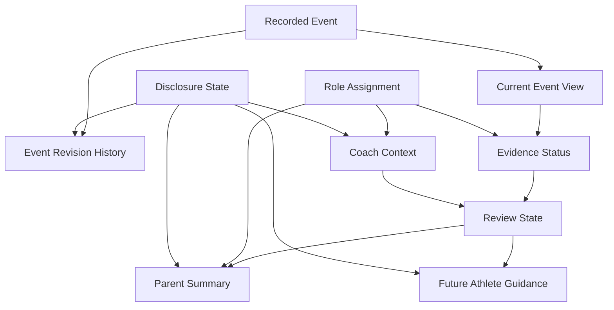

# Architecture Plan

## Objective

Build the durable foundation required for Project One without launching the Project One experience. The foundation must make evidence trustworthy before interpretation becomes more powerful.

## Current Foundation Reused

Existing LaxHornet already has useful primitives:

- Teams and roster players.
- Parent player claims.
- Team access requests.
- Saved games and events.
- Offline local tracking.
- Game review, event edits, tags, and exports.
- Live Share read-only timelines.
- Supabase Auth plus existing team/roster RPCs.

Those systems should be reused where safe. The Project One foundation should be additive and feature-flagged.

## Target Foundation Components

1. Role assignments
   - Adds explicit scoped roles without silently changing current access.
   - Supports `parent`, `coach`, `team_admin`, `club_admin`, and `platform_admin`.

2. Immutable event revisions
   - Keeps original events recoverable.
   - Stores every correction as a revision rather than treating `correctedAt` as complete history.

3. Coach context records
   - Separates factual coach context from generic notes, tags, interpretation, and recommendations.

4. Cloud review state
   - Persists review progress across devices and roles.
   - Starts with evidence-facing states only.

5. Evidence status records
   - Allows evidence to be recorded, marked context-needed, context-added, or reviewed.
   - Keeps heuristic suggestions separate from human authority.

6. Disclosure state
   - Controls who may see original evidence, revisions, coach context, notes, tags, summaries, and future athlete guidance.
   - Must be enforced by trusted backend rules, not hidden UI.

7. Compatibility adapters
   - Current games and events remain readable.
   - Legacy records can be normalized at read time until explicit migration is approved.

8. Feature flags and versioning
   - `PROJECT_ONE_FOUNDATION` and `PROJECT_ONE_EVIDENCE_REVIEW` remain off by default.
   - Review records include feature version to prevent interpretation drift.

## Staged Implementation Order

A. Role model and secure permissions

B. Immutable event revisions

C. Coach-context records

D. Cloud review state

E. Evidence status

F. Disclosure enforcement

G. Compatibility adapters

H. Tests

Each stage must be secured and tested before the next stage starts. If RLS or role isolation cannot be proven, stop.

## Data Separation Standard

Project One features must keep these layers distinct:

- Fact: raw recorded event, timestamp, game context, score context, field zone.
- Context: factual human context added later by an authorized role.
- Interpretation: system-generated or human-generated explanation of meaning.
- Recommendation: a suggested next focus or development action.
- Human decision: parent, coach, admin, or later athlete action.

The app should never blur absence of data into certainty. For example, no note on an event does not mean context is needed, and raw event timing does not prove motivation, confidence, decision quality, effort, or intent.

## Offline and Cloud Behavior

LaxHornet remains offline-first for game capture. Foundation records should support offline creation, but immutable revisions require conflict-safe syncing:

- Offline new events get temporary client IDs and source metadata.
- Offline event edits create pending revision records rather than overwriting evidence.
- When syncing, revisions are appended with monotonic sequence rules.
- Conflicting edits are preserved as separate revisions and flagged for review.
- Review state conflicts use conservative escalation, not last-write-wins.
- Deletions tombstone related review metadata so hidden records do not reappear across devices.

## Stop Conditions

Stop implementation if any of these are true:

- Secure role enforcement cannot be expressed with Supabase RLS or controlled RPCs.
- Parent and coach data cannot be isolated.
- Immutable revision conflicts would silently destroy evidence.
- A migration rewrites or destroys existing event history.
- Offline sync can create silent evidence loss.
- Production access would be broadened accidentally.
- Live Share could expose private context.
- Rollback would require deleting existing production user data.

## Diagrams

