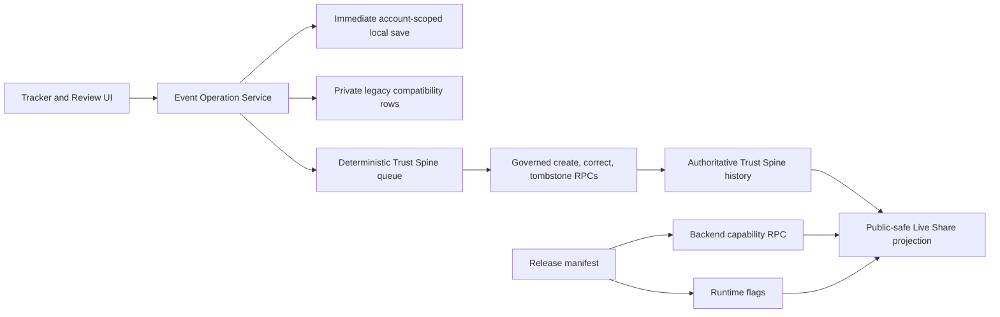

# Architecture Boundary

```mermaid
flowchart LR
  UI["Tracker and Review UI"] --> OPS["Event Operation Service"]
  OPS --> LOCAL["Immediate account-scoped local save"]
  OPS --> LEGACY["Private legacy compatibility rows"]
  OPS --> QUEUE["Deterministic Trust Spine queue"]
  QUEUE --> RPC["Governed create, correct, tombstone RPCs"]
  RPC --> HISTORY["Authoritative Trust Spine history"]
  HISTORY --> SHARE["Public-safe Live Share projection"]
  CAP["Backend capability RPC"] --> SHARE
  FLAGS["Runtime flags"] --> SHARE
  MANIFEST["Release manifest"] --> FLAGS
  MANIFEST --> CAP
```

The browser no longer chooses a legacy or Trust Spine write path at each feature call site. All event mutations enter the event-operation service.
