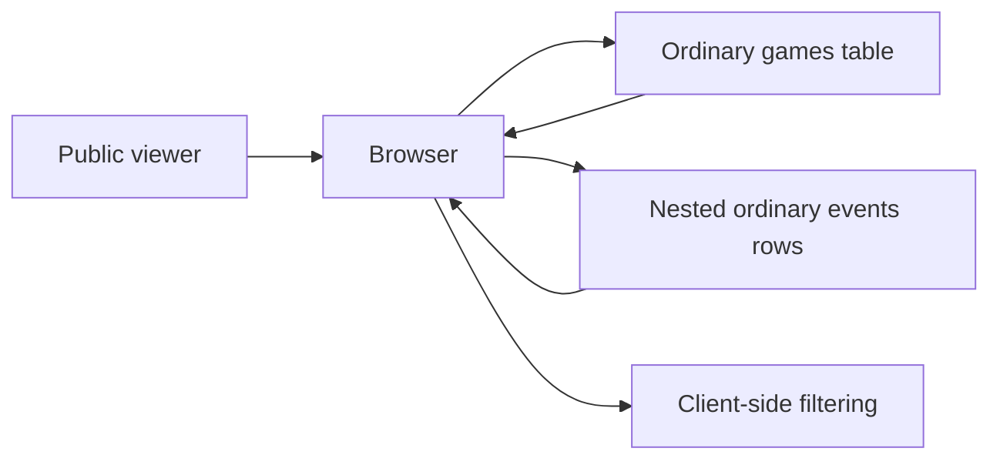
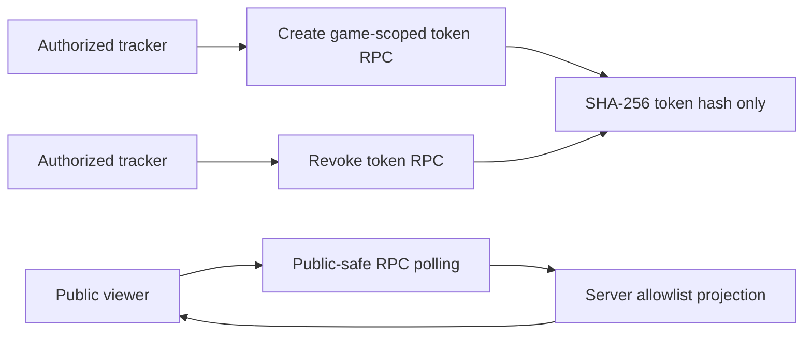
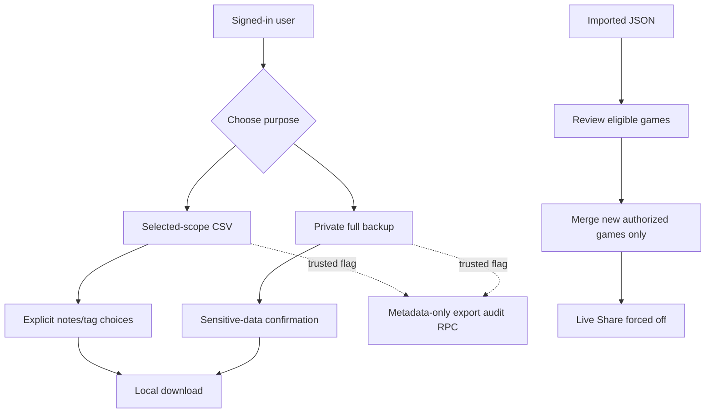

# Disclosure Data Flows

## Live Share Before

Risk: ordinary rows reached the browser before public fields were filtered, and
future private columns could be inherited by a wildcard query or subscription.

## Live Share Staging Target

- The raw 32-character token is returned once and is not stored in the table.
- Unknown, expired, and revoked tokens return the same neutral `null` response.
- Anonymous users cannot select from ordinary `games`, `events`, token, or audit
  tables.
- The browser polls the allowlisted RPC every four seconds. It does not subscribe
  to unrestricted ordinary-table changes.
- Runtime flags remain off by default. Production continues its legacy path
  until a separately approved cutover.

## Export and Import

Imports cannot restore authority, roster membership, player claims, access
requests, share tokens, or account ownership. Existing same-ID games are not
silently replaced, and tombstoned games are not resurrected.

