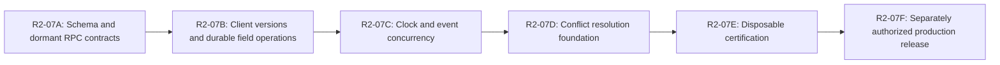

# R2-07 Implementation Sequence

Status: `REVIEW REMEDIATION — INDEPENDENT EXACT-HEAD REVIEW PENDING`

Remediation baseline: `0e90e3b4017d65ef35bdf95fc165b3379a4c6844`

No phase below is authorized by this design task. Each phase requires its own
approved ticket, branch, exact scope, tests, independent exact-PR-SHA Level 3
review, and merge decision. Do not combine the phases into one pull request.

## Dependency flow

R2-07A may be locally tested before B, but no production schema application is
part of A. E certifies the integrated exact SHA after all implementation PRs
merge. F is a release/operations decision, not an implementation continuation.

## R2-07A — Schema and dormant RPC contracts

### Objective

Implement the additive schema, field-group/version rules, operation and change
journals, immutable conflict/resolution storage, RLS/grants, and dormant
versioned RPC signatures. Do not activate production writes.

### In scope

- timestamped additive forward migration and pre-activation rollback/refusal;
- game version/lifecycle/score columns and safe backfill;
- operation, attempt, field-change, conflict, and resolution tables;
- RLS, FORCE RLS, ACLs, private helpers, allowlist constraints, immutable
  triggers, and indexes;
- `laxhornet_sync_game_v2` and resolution/read contracts returning
  `r207_not_activated` outside local test mode;
- shared R2-06A advisory-lock order and tombstone-first behavior;
- preliminary operation lookup with no result disclosure, followed by the
  shared game lock, authoritative tombstone check, current personal-versus-team
  authority recheck, and mandatory post-lock operation recheck before replay or
  semantic mutation;
- personal conflict access from current canonical personal-game owner/account
  authority; team conflict access only from current canonical team/roster
  tracking authority, including `laxhornet_can_track_roster_player` where
  applicable; copied/historical owner identity is not authority;
- database/pgTAP/disposable concurrency tests;
- no release-manifest runtime hash or production application.

### Exit criteria

- populated v285-shaped migration passes forward/pre-activation rollback tests;
- version increments, non-overlap merge, same-field conflict, replay/mismatch,
  tombstone, privacy, RLS/grants, and lock tests pass;
- accepted/conflict/resolution replay cannot outrank deletion or current
  authority, and denial discloses no private values or conflict existence;
- simultaneous identical first-seen requests produce one canonical mutation
  and one replay after the lock, with no duplicate evidence or uniqueness
  error; same-ID/different-hash concurrency fails safely;
- existing R2-06/R2-06A bytes and guarantees remain intact;
- exact-head Level 3 review passes;
- server capability remains disabled and production is unchanged.

### Explicit exclusions

Client runtime, clock command migration, event routing, conflict UI, production
schema application, deployment, release activation.

## R2-07B — Client version tracking and field operations

### Objective

Hydrate server versions, represent field operations durably, submit v2 patches
when the server capability is enabled in disposable environments, and persist
accepted/merged/conflict/deleted/replay results truthfully.

### In scope

- local schema upgrade preserving future/unknown versions;
- game version map and `score_known` initialization behavior;
- immutable-after-attempt operation payloads and group dependency scheduling;
- metadata, score, status, roster-context, and sharing-safe client operation
  builders;
- v2 response parsing and R2-05 classification integration;
- lossless hydration with server versions and local-only evidence;
- conflict ID/state persisted locally; no full polished resolver yet;
- stale v285 upgrade-required handling in fixtures;
- focused unit/browser/offline/out-of-order tests.

### Exit criteria

- local write still precedes cloud work;
- client never predicts server versions or defaults missing bases;
- affected operation only compacts after a persisted receipt;
- conflicted work survives refresh/offline reload and does not loop;
- unrelated groups continue safely;
- R2-03 hydration and R2-04/R2-05 operation/error guarantees pass;
- exact-head Level 3 review passes.

### Explicit exclusions

Production capability activation, v1 rejection, clock timeline rewrite, legacy
event correction cutover, rich sync journal, deployment.

## R2-07C — Clock and event concurrency

### Objective

Replace clock absolute-snapshot ambiguity with versioned command/batch
semantics, enforce lifecycle/delete boundaries, and ensure every new-client
event correction/delete path is per-event versioned.

### In scope

- server-anchored clock fields and bigint revision validation;
- online clock command and ordered offline batch RPCs;
- permanent command IDs, stable replay, stale conflict, atomic batch behavior;
- shared game advisory lock before tombstone/game/clock reads;
- atomic pause/resume/completion interaction with lifecycle and score;
- canonical event tombstone check under the shared game boundary;
- personal/legacy event routing through canonical operations or an equivalent
  per-event versioned RPC;
- removal of new-client direct last-write-wins event correction/delete;
- two-device clock/event and derived-total tests.

### Exit criteria

- concurrent start/start and delayed stop/start never silently lose time;
- offline clock batch applies completely or conflicts completely;
- client does not predict intermediate server revisions;
- completion and deletion boundaries are atomic;
- unique event appends preserve both, event edits/deletes are versioned, and
  game deletion rejects all event mutations;
- exact-head Level 3 review passes.

### Explicit exclusions

Automated clock-timeline adjudication, device lease, full event-store rewrite,
production activation.

## R2-07D — Conflict resolution foundation

### Objective

Provide the minimum safe user and RPC surface so no conflict is silently
discarded or permanently opaque while richer R2-08 sync presentation remains
deferred.

### In scope

- authorized conflict summary/read contract with derived status;
- tombstone-aware conflict RLS/read RPC: retained conflicts for deleted games
  expose no private row through app-role direct SELECT, while an authorized
  bounded read returns only `game_deleted` after the shared lock;
- identical current-authority rules across direct-table RLS, conflict/read
  RPCs, replay disclosure, resolution, and retention eligibility: personal
  owner/account for personal games, current roster tracking authority for team
  games, and only the existing bounded allowlisted reviewer path;
- append-only resolution RPC with keep server, apply proposed, custom patch,
  and dismiss;
- stale-resolution linked conflict behavior;
- deletion terminal resolution;
- minimal nontechnical Needs Attention list/notice/actions;
- safe field labels and bounded values only;
- account switch, revoked authority, accessibility, and narrow-mobile tests;
- retention eligibility logic, without running a production purge.

### Exit criteria

- conflict content is immutable and private;
- each resolution is idempotent and version-checked;
- stale resolution cannot overwrite newer state;
- account/team/Live Share isolation passes;
- team authority revocation blocks conflict read, replay disclosure, resolution,
  and retention access even when the actor is the historical creator or copied
  owner/account; personal authority loss follows the same current-authority
  principle where applicable;
- game remains usable for unaffected work;
- exact-head Level 3 review passes.

### Explicit exclusions

Rich journal/history visualization, automatic adjudication, bulk conflict
resolution, production retention job activation, R2-08 redesign.

## R2-07E — Disposable integrated certification

### Objective

Certify the merged R2-07 implementation at one exact SHA using disposable,
non-production database and two-device/browser journeys.

### In scope

- reconstruct exact migrations on a populated v285 fixture;
- forward/pre-activation rollback and post-evidence rollback refusal;
- full unit/database/RLS/concurrency/two-device/browser matrix from
  `R2-07_TEST_PLAN.md`;
- out-of-order, timeout-after-commit, stale service worker, account switch,
  revocation, deletion race, and conflict-resolution adversarial probes;
- accepted/conflict replay after deletion, replay after personal/team authority
  loss, direct read/resolution after team revocation, simultaneous identical
  first-seen requests, and simultaneous same-ID/different-hash requests;
- account-switch rejection while replay/conflict-read responses are in flight,
  private-value containment on every denial, one canonical concurrent result,
  no exposed uniqueness error, and no R2-06 tombstone-precedence regression;
- performance/query plan/storage budgets;
- exact migration/RPC/content hashes and zero-residue cleanup;
- complete canonical-plus-additive local regression once after final diff;
- independent exact-SHA Level 3 review.

### Exit criteria

- every mandatory scenario passes or the rollout stops;
- no synthetic residue remains in the disposable target;
- no private/production data or connector is used;
- exact-SHA review is PASS with no blocking finding;
- production activation remains unauthorized.

### Explicit exclusions

Production preflight, schema application, release marker/cache change,
deployment, production verification.

## R2-07F — Separately authorized production release

### Objective

Only after A–E pass, perform a separately reviewed release that applies the
schema/cutover in the approved order and deploys the compatible runtime.

### Required fresh authority

- exact reviewed release SHA and migration identities;
- named production target and allowed commands/connectors;
- migration and activation order;
- rollback/fail-closed decision points;
- bounded production verification scope and synthetic fixture/cleanup plan if
  any mutation is authorized;
- coordinated version, service-worker cache, script-query, manifest, and Pages
  release controls;
- explicit merge/deploy/production authorization from David.

### Required order

1. Read-only preflight against the exact release SHA and catalog.
2. Apply additive schema/dormant contracts if not already present under the
   approved release procedure.
3. Deploy the R2-07-capable runtime with capability dormant.
4. Verify client compatibility and no unversioned bypass.
5. Apply atomic activation: enable v2, disable unversioned writes, keep v1
   upgrade-required stub.
6. Perform only authorized bounded verification.
7. Verify cleanup/zero unexpected residue and publish durable evidence.

Any failed gate stops before the next mutation. A post-activation problem
disables writes fail-closed or rolls back only to an R2-07-compatible runtime;
it never restores v285 unversioned cloud mutation.

## Cross-phase decisions requiring David approval

The following are provisionally approved design recommendations for David's
decision. They do not authorize R2-07A or any implementation, migration,
release, deployment, or production work:

- approve the hybrid field-group plus operation-journal model;
- approve direct score aggregate with delta/correction semantics;
- approve post-completion metadata bounds and no initial reopen;
- approve server clock authority without a device lease;
- approve versioned RPC plus eventual v1 upgrade-required cutover;
- approve minimum R2-07D UX scope versus R2-08;
- approve conflict-data allowlist and proposed 180-day resolved retention,
  subject to privacy/legal review;
- approve the six-phase ticket sequence.

Approval of these recommendations still does not authorize implementation or
production. R2-07A requires a separate explicit authorization after a clean
independent Level 3 PASS against the exact remediation PR head.

Final sequencing disposition:
`R2-07 DESIGN REMEDIATED — EXACT-HEAD INDEPENDENT LEVEL 3 REVIEW PENDING`.
